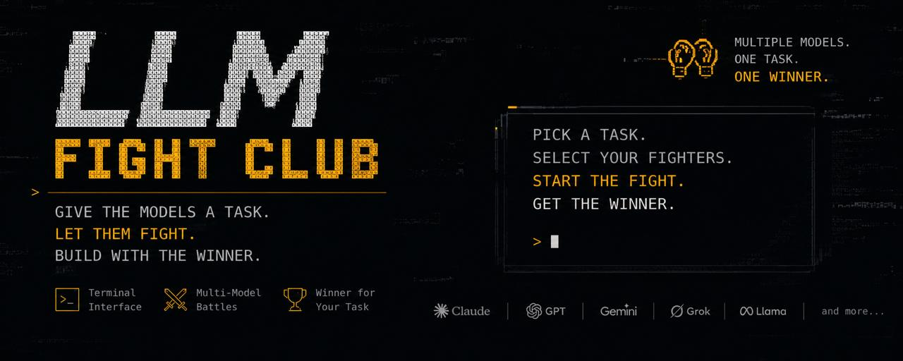

# LLM FIGHT CLUB

> **Give the models a task. Let them fight. Build with the winner.**

**LLM Fight Club** is a terminal where AI agents fight against each other to find the best model for **your specific task**.

Instead of asking *"Which LLM is the best?"*, you give the models the task and let them prove it.

Pick a task.
Choose your fighters.
Start the fight.
Watch them compete.
Build with the winner.
<p align="center">
  
</p>

---

## How it works

### 1. Choose your task

Give the Fight Club any task you want to solve.

```text
Build a Rust CSV parser that handles
quoted fields, escaped quotes and malformed rows.
Include tests.
```

### 2. Send in the fighters

Multiple LLM agents receive the **same task** and work on it independently.

```text
              🥊 LLM FIGHT CLUB

       Claude    GPT    Gemini    Grok
          │       │       │        │
          └───────┴───────┴────────┘
                    │
                YOUR TASK
```

### 3. Let them fight

Each agent produces its own solution.

The Fight Club evaluates the results using objective checks whenever possible:

* Tests
* Compilation
* Correctness
* Output validation
* Requirements
* Edge cases
* Code quality

For subjective tasks, agents can also be evaluated by a blind judge.

### 4. Eliminate the weak

The fighters are scored against each other.

```text
ROUND 1

CLAUDE    █████████
GPT       ████████
GEMINI    ███████
GROK      ██████    ← ELIMINATED

ROUND 2

CLAUDE    █████████
GPT       ████████  ← ELIMINATED

FINAL

CLAUDE    🏆
```

### 5. Build with the winner

The final fighter is the model that performed best **for your task**.

```text
╭─────────────────────────────╮
│        🏆 WINNER            │
│                             │
│        CLAUDE               │
│                             │
│  SCORE      8.7 / 10        │
│  LATENCY    2.4s            │
│  COST       $0.018          │
│  TESTS      42 / 42         │
│                             │
│  → BUILD WITH CLAUDE        │
╰─────────────────────────────╯
```

---

## Why LLM Fight Club?

There is no single best LLM.

One model might be better at coding.

Another might be better at reasoning.

Another might produce better writing.

And the model that wins on a benchmark might not be the model that performs best on **your actual problem**.

LLM Fight Club lets you test them against each other on the work you actually care about.

**Don't argue about which model is better. Make them fight.**

---

## What can you fight about?

Pretty much anything:

```text
CODING
→ Build a REST API
→ Fix a broken codebase
→ Write a parser
→ Optimize an algorithm

REASONING
→ Solve a complex problem
→ Analyze a system
→ Find the best approach

RESEARCH
→ Investigate a topic
→ Compare competing ideas
→ Analyze a dataset

WRITING
→ Write an article
→ Create marketing copy
→ Develop a story

AGENTS
→ Complete a multi-step task
→ Use tools
→ Navigate a workflow
```

The important part is that **the task comes first**.

The winner is determined by how well a model handles that particular task.

---

## The Terminal

Everything happens inside the Fight Club terminal.

```text
╔══════════════════════════════════════════════════╗
║                 LLM FIGHT CLUB                  ║
╠══════════════════════════════════════════════════╣
║                                                  ║
║  TASK                                             ║
║  Build a Rust CSV parser                          ║
║                                                  ║
║  FIGHTERS                                         ║
║  ● Claude                                         ║
║  ● GPT                                            ║
║  ● Gemini                                         ║
║  ● Grok                                           ║
║                                                  ║
║              [ START FIGHT ]                     ║
║                                                  ║
╠══════════════════════════════════════════════════╣
║                                                  ║
║       CLAUDE          VS          GPT             ║
║                                                  ║
║       ████████████               █████████        ║
║                                                  ║
║                  ROUND 2                         ║
║                                                  ║
╚══════════════════════════════════════════════════╝
```

The terminal gives you a visual overview of the fight, the current round, model performance, scores, and the eventual winner.

---

## Core Philosophy

### Your task > generic benchmarks

The best model depends on what you're actually trying to do.

### Let models compete

Don't rely on assumptions about which model should win.

### Test whenever possible

If a solution can be tested objectively, test it.

### Blind evaluation

When human-like judgment is required, hide the model identity to reduce bias.

### Cost and speed matter

The "best" model isn't always the most capable one.

A cheaper, faster model that solves your task just as well may be the better fighter.

---

## Status

🚧 **Early prototype**

LLM Fight Club is actively being developed.

Current focus:

* Multi-model execution
* AI agent orchestration
* Fight / elimination system
* Objective verification
* Blind judging
* Cost tracking
* Latency tracking
* Terminal UI
* Winner selection
* Winner handoff
* Benchmark history

---

## Philosophy

**The models don't get to tell you who's the best.**

**You make them fight.**

---

## License

MIT

